# 中国海洋大学教务系统插件

中国海洋大学教务系统插件 JW-Helper 由爱特工作室制作，教务系统老旧，对部分主流浏览器不适配，存在部分按钮、链接无法点击，通过安装本插件可以解决这些问题。

## 运行环境

Chromium 内核浏览器

- Google Chrome

  下载地址：https://www.google.cn/chrome/

- 新版 Microsoft Edge

  下载地址：https://www.microsoft.com/zh-cn/edge

- QQ 浏览器 for Windows

  下载地址：https://browser.qq.com

## 安装插件

1. 下载插件压缩包

   下载地址：https://github.com/ITStudioOUC/JW-Helper/releases

   下载最新版本 Latest release 的 ITStudio-JW-Helper.zip

2. 解压插件压缩包

   解压已下载的插件压缩包，将解压后的文件夹放到合适的位置，防止误操作将文件夹删除。

   **注意**：解压后的文件夹一定不能删除

3. 浏览器安装插件

   Google Chrome 安装流程：

   - 点击右上角三个点，选择更多工具中的拓展程序

     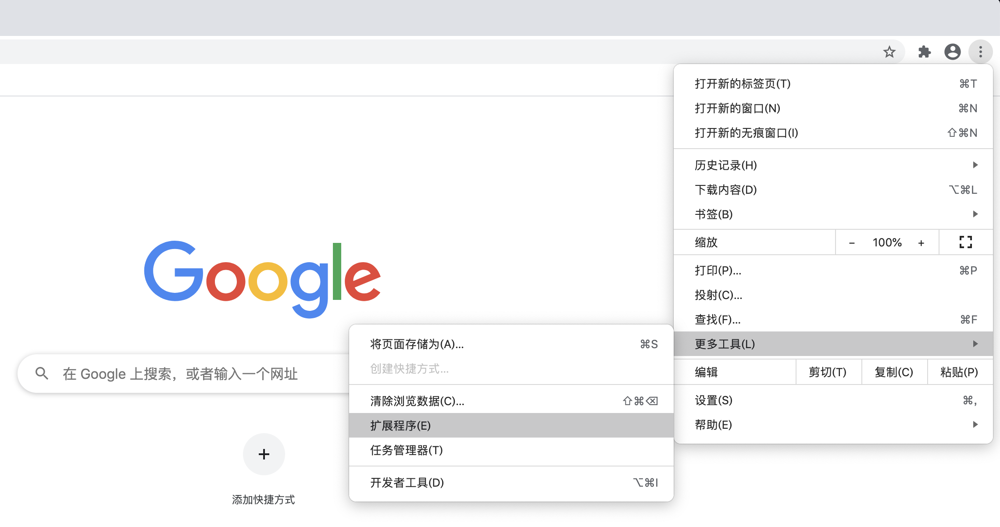

   - 开启右上角的开发者模式

     

   - 选择加载已解压的扩展程序

     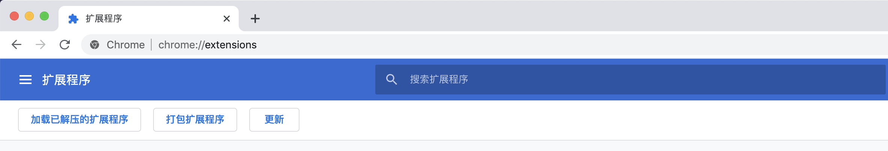

   - 选择压缩文件解压后的文件夹

     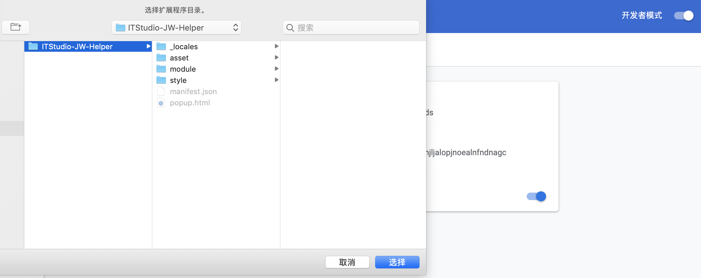

   - 插件安装成功

     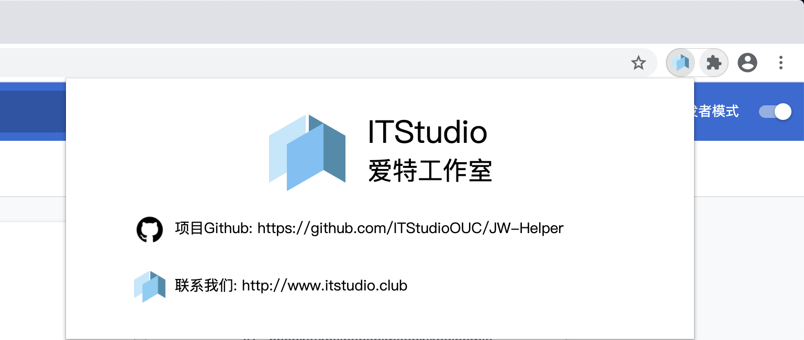

   新版 Microsoft Edge 安装流程：

   - 点击右上角三个点，选择扩展

     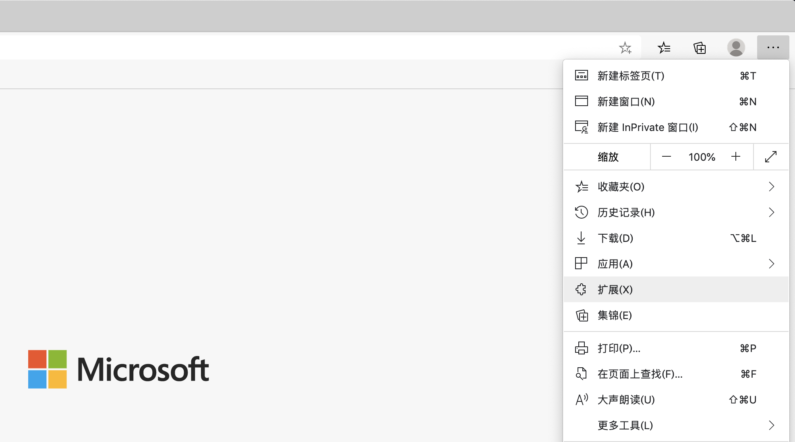

   - 开启左下角的开发人员模式和允许来自其他应用商店的扩展

     

   - 选择加载解压的扩展

     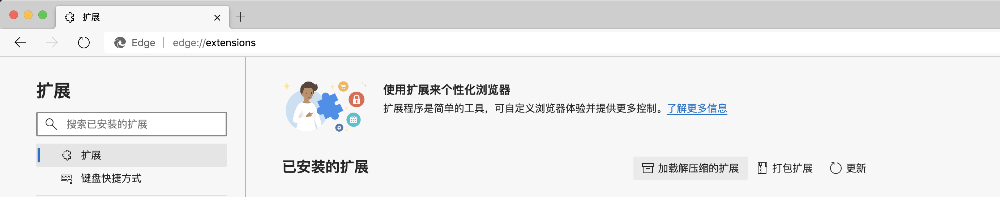

   - 选择压缩文件解压后的文件夹

     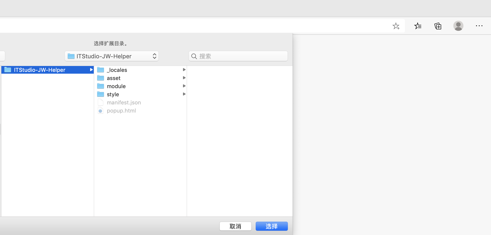

   - 插件安装成功

     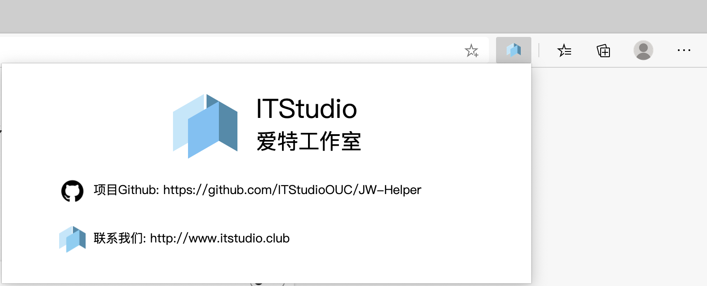

   QQ 浏览器 for Windows 安装流程：

   - 点击右上角三个横杠，选择应用中心

     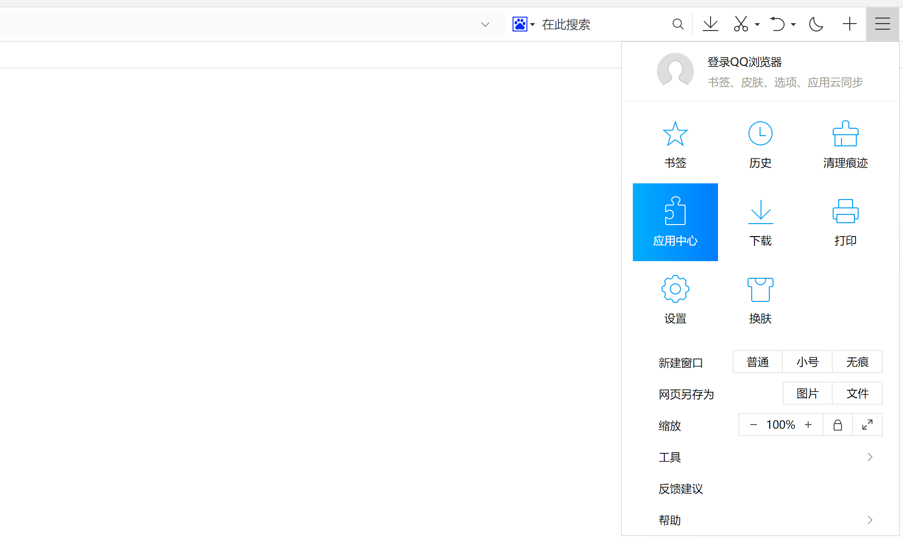

   - 选择管理我的应用

     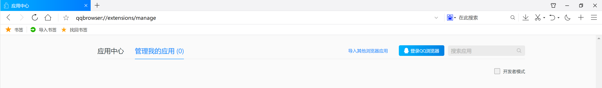

   - 开启右上角的开发者模式

   - 选择加载已解压的扩展程序

     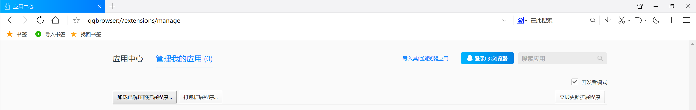

   - 选择压缩文件解压后的文件夹

     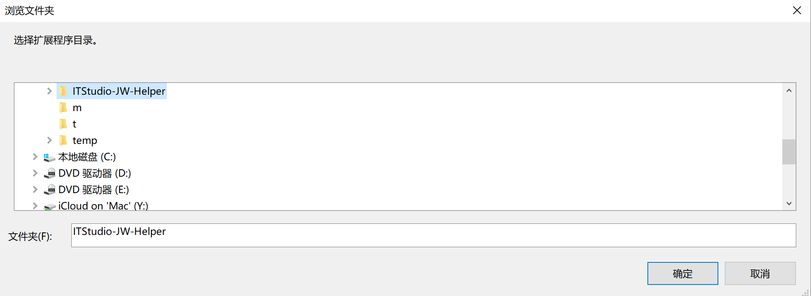

   - 插件安装成功

     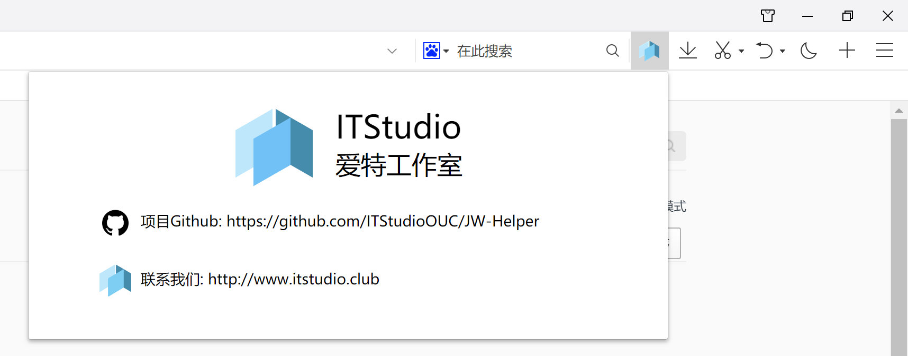

4. 现在可以愉快地玩耍教务系统了

## 已适配或解决的问题

### Version 0.1

-   教务通知无法点击打开的问题

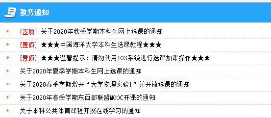

-   校内通知无法点击打开的问题

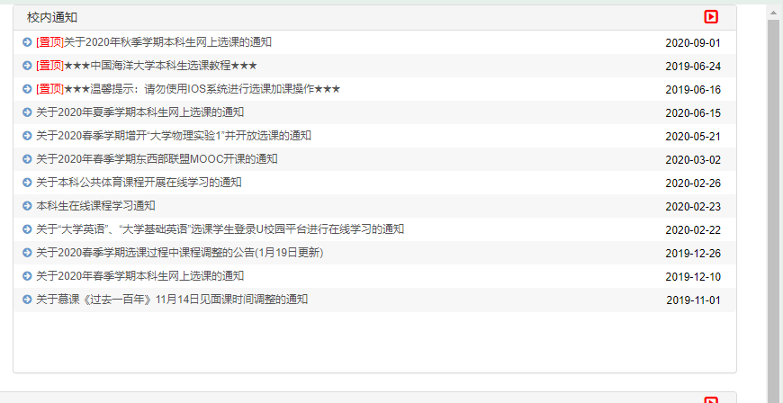

-   选项卡无法点击切换的问题

-   弹出窗口的样式的微调（好像也不算什么问题

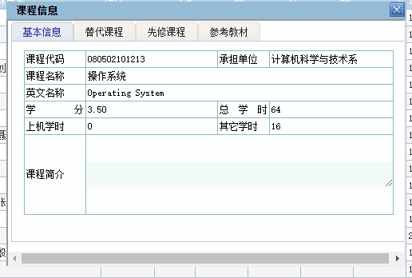

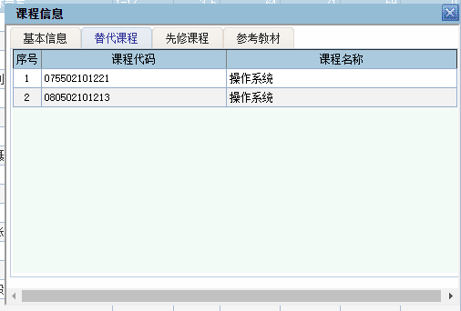

## 问题

如果插件在使用中出现问题，请联系我们。

## Ideas

大家可以在该项目的 issue 中提出想要优化的东西，我们会尝试进行解决。

## 联系我们

爱特工作室 ITStudio

爱特展示网：http://www.itstudio.club

本项目 Github 地址：https://github.com/ITStudioOUC/JW-Helper

中国海洋大学崂山校区信息科学与工程学院北楼 B505
